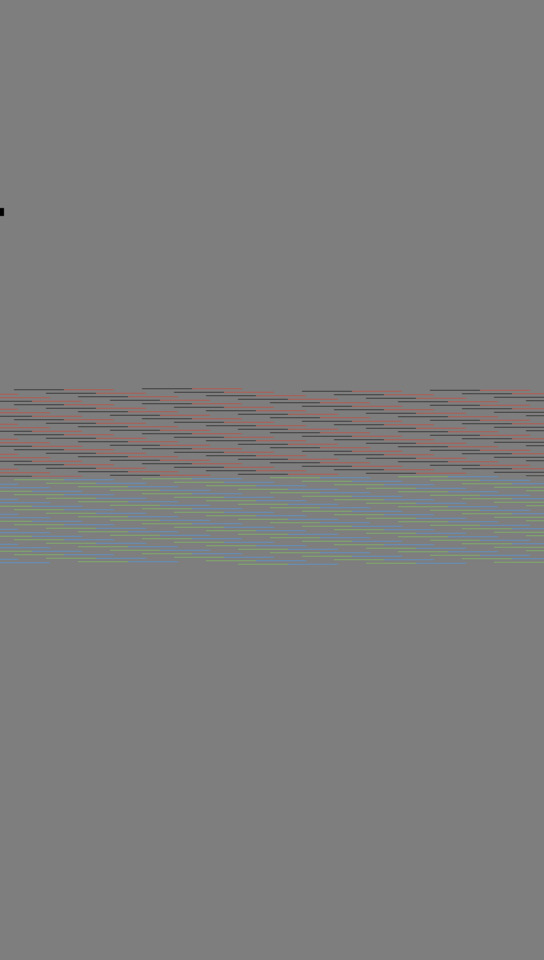

# i2fb

 This repository provides `i2fb`, a simple and straightforward tool to display images on the screen of a Raspberry Pi using its framebuffer only and therefore without the need to run any window system / desktop software like X.

## Using i2fb

Once installed use the `i2fb` script by passing the file path to an image and add some optional parameter described below.

Based on the backround information given in the next section, `i2fb` automatically calculates the parameters needed to provide the options described in the table below to decode and show images on the screen of a Raspberry Pi's by sending the result to the framebuffer. It automatically takes into account the resolution and rotation of the screen.

```
i2fb [options] <path-to-image>
```

| Option | Examples | Description |
|:--------|:--------|:--------|
| <tt>-b &#124; --buffer fb0 &#124; fb1 </tt> | <tt>-b fb0</tt> | The frame buffer to be used for displaying the image. `fb0`is usually connected to the HDMI output while `fd1`is used for TFT screens. Default is <tt>fb0</tt>
| <tt>-c &#124; --color &lt;color&gt;</tt> | <tt>-c black</tt> | The background color used to fill areas not covered by the image. Use any common CSS color format to define the color (e.g. <tt>#34285a</tt>. Default is <tt>gray</tt> |
| <tt>-f &#124; -\-fill image</tt>  |<tt>-f image</tt> | Makes sure the entire image is shown while using the available size of the screen as much as possible. |
| <tt>-f &#124; -\-fill width</tt>  |<tt>-f width</tt>  | Makes sure the image to be shown fills the entire width of the screen taking any rotation configured into account. The image will be centered on the screen and excess parts that can not be shown at the zoom factor needed to fill the screen in width will not be visible. |
| <tt>-f &#124; -\-fill height</tt>  |<tt>-f height</tt> | Makes sure the image to be shown fills the entire height of the screen taking any rotation configured into account. The image will be centered on the screen and excess parts that can not be shown at the zoom factor needed to fill the screen in height will not be visible. |
| <tt>-f &#124; -\-fill screen</tt>  |<tt>-f screen</tt> | Makes sure the image to be shown fills the entire height and width of the screen taking any rotation configured into account. The image will be centered on the screen and excess parts that can not be shown at the zoom factor needed to fill height and width of the screen will not be visible. |
| <tt>-r &#124; -\-rotate &lt;degrees&gt;</tt> | <tt>-r 45</tt> | Rotate the image after taking into account any rotation configured for the screen in /boot/config.txt using the display_rotate option.
| <tt>-z &#124; -\-zoom &lt;percentage&gt; &#124; &lt;boundgin box&gt;</tt>|<tt>-z 150% </br>-z 500x800</tt> | Zoom the image by the percentage given or make sure the image fits into the bounding box given. The image will be centered on the screen and excess parts that can not be shown will not be visible. |

## Installing i2fb

### Make sure ImageMagick is installed
Installing `i2fb` is rather simlple. The only dependency this script has is the need for [ImageMagick](http://www.imagemagick.org/script/index.php) to be present which can be installed easily using the following command:
```
sudo apt update && sudo apt install imagemagick
``` 

### Allow hiding the blinkig cursor
The text console usually shows a blinking cursor. In order to allow i2fb to turn this off, it is neccessary to adjust the access rights of the special file used for that. Do do this, execute the following command once:
```
sudo chmod a+w /sys/class/graphics/fbcon/cursor_blink
```

### Install i2fb
Now download the `i2fb` script to your machine and add a link that makes it available as a command line tool:
```
cd /opt
sudo git clone https://github.com/mataebi/i2fb.git
sudo ln -s /opt/i2fb/i2fb /usr/local/bin/i2fb
```
Use the following command to get a list of all options that are available:
```
i2fb --help
```
### Test i2fb


Test the i2fb installation using the following command:
```
i2fb -f image -r 45 /opt/i2fb/squares.jpg
```
You should see the four colored squares rotated at 45 degrees in the middle of the screen with two corners touching the edges as shown on the left. The rectangles should be drawn on a gray background.

## How i2fb works

You do not need to read this section to use i2fb. It is here for reference if you are interested to understand its underlying mechanism.

### Framebuffer Basics

There are various attempt to provide a software for the Raspberry Pis that allows rendering images directly into the «Framebuffer» instead of using a window system like X or Wayland that take care of hiding the details of the underlying video hardware but come at the cost of additional complexity and CPU cycles needed when displaying an image on a screen.

Using the frambuffer is almost the opposite as it provides simple access ot a part of the memory directly linked to a screen that might be attached (aka the framebuffer). There are typically two framebuffers available on a Raspberry Pi that can be accessed using the virtual devices `/dev/fb0` and `/dev/fb1`. `/dev/fb0` is usually connected to the hardware producing an HDMI signal while `/dev/fb1` is typically connected to a TFT screen.

### Existing Software

When it comes to rendering images directly into a framebuffer most [people either point](https://forums.raspberrypi.com/viewtopic.php?t=130059) to [fbi](http://manpages.ubuntu.com/manpages/bionic/man1/fbi.1.html) or or to the «improved version of fbi» called [fim](http://manpages.ubuntu.com/manpages/bionic/man1/fim.1.html). While `fbi` seriously lacks a reasonable concept for zooming, `fim` would fix all of these flaws but needs to be compiled which does not seem possible anymore with current tools and libaries.

### Basics of i2fb

This is where `i2fb` comes in which is basically a simple wrapper for the widely used and very powerful [ImageMagick](http://www.imagemagick.org/script/index.php) software that not only claims to be able to convert [more than 200 image formats](http://www.imagemagick.org/script/formats.php) but also allows complex image transformations with a few commands and parameters on the command line. Its main command `convert` can be used to render an image available in any of the formats supported by ImageMagick directly into a bitmap that can be written directly to the frame buffer.

To install ImageMagick which is the foundation of i2fb install it first using the following command
```
sudo apt update && sudo apt install imagemagick
```
The next step is to make sure your HDMI screen and framebuffer are properly setup. Instead of the 1920 x 1080 pixel resolution used in the examples below you may of course use any other resolution. However, in these cases you will have to calculate and adjust the zoom values accordingly to use the examples manually. But of course if you use i2fb instead of using the explcit example commands given below, the software will take care of that for you.

To have a simple and easy way to see what is rendered and why download and copy the image below to your Raspberry Pi. The scp command is usually the easiest way to get this done.

As a next step make sure the resolution of your HDMI screen is properly set. Using the following instructions will typically set it to full HD (1920 x 1080) pixels. To do this either run sudo raspi-config then select `Display Options` > `Resolution` > `DMT Mode 82 1920x1080 60Hz 16:9` or edit the configuration file of your Raspberry Pi with an editor, e.g. `sudo vi /boot/config.txt` and make sure the three settings below are configured. On a Raspberry Pi make sure `dtoverlay=vc4-fkms-v3d` is not activaed
```
# Force DMT mode
hdmi_group=2

# Select the 1920x1080 resolution
# See also https://www.raspberrypi.com/documentation/computers/config_txt.html#hdmi_mode
hdmi_mode=82

# Uncomment to force a HDMI mode rather than DVI.
# This can make audio work in DMT (computer monitor) modes
hdmi_drive=2

# dtoverlay=vc4-fkms-v3d
```
Please note you have to reboot your machine after changing any of these settings.

The command below, used to decode and transfer the sample image to the framebuffer, assumes you have set your HDMI output to 1920x1080 pixels and that your screen is not rotated at this point (i.e. there is no active display_rotate=... configuration except `display_rotate=0` which sets «no rotation») If those settings are correct you shout get the following results for the `tvservice -s` command showing HDMI settings and  `fbset` showing the frame buffer configuration
```
$ tvservice -s
state 0xa [HDMI DMT (82) RGB full 16:9], 1920x1080 @ 60.00Hz, progressive
```
```
$ fbset
mode "1920x1080"
    geometry 1920 1080 1920 1080 32
    timings 0 0 0 0 0 0 0
    rgba 8/16,8/8,8/0,8/24
endmode
```
Make sure the HDMI settings as well as the framebuffer configuration use 32 Bit / pixel (RGB + Transparency) as otherwise the encoding of the bits in the framebuffer uses a different and rather complex format.

### Showing Images manually

Once you have configured your hardware as described above to use full HD without rotation you may try the commands below to see how decoding and sending an image works using ImageMagicks convert command. To just show our example image on the screen without scaling it in any way use the following command:

<table><tr><td></td>
<td><pre><code>convert -extent 1920x1080 -background gray -gravity center \
/opt/i2fb/squares.jpg bgra:/dev/fb0</code></pre></td></tr></table>

Given the size of the image being 200x200 pixels the factor needed to scale the image to fill the height of the screen is easily calculated as 1080 (screen height) / 200 (height of image) = 5.4 = 540%
<table><tr><td></td>
<td><pre><code>convert -resize 540% -extent 1920x1080 -background gray \
-gravity center /opt/i2fb/squares.jpg bgra:/dev/fb0</code></pre></td></tr></table>

In order to have the image scaled to fill the entire screen use the width of the screen and calculate 1920 / 200 = 9.6 = 960%
<table><tr><td></td>
<td><pre><code>convert -resize 960% -extent 1920x1080 -background gray \
-gravity center/opt/i2fb/squares.jpg bgra:/dev/fb0</code></pre></td></tr></table>

### Rotated screen

Unfortunately things get slightly more tricky when using screen rotation as it is provided by Raspbian. You may use the following settings in /boot/config.txt to rotate your framebuffer and screen which is particularily important to use your monitor in Portrait mode instead of Landscape as it is often the case when using a screen as a digital picture frame.

#### Setting screen orientation
| Setting | Oreintation |
|--------|--------|
| display_rotate=0 | Standard Landscape mode |
| display_rotate=1 | Portrait rotated 90º clockwise |
| display_rotate=2 | Landscape upside-down |
| display_rotate=3 | Portrait rotated 90º counter-clockwise |

While the above convert examples work as expected when using display_rotate=0 or display_rotate=2 you might get a rather unexpected results if you use them in Portrait mode. Try setting display_rotate to 1 or 3 and reboot your machine. You might also want to physically rotate your monitor to be able to read any console output mor easily.

Now try the the same convert commands as above using
<table><tr><td></td>
<td><pre><code>convert -extent 1920x1080 -background gray -gravity center \
/opt/i2fb/squares.jpg bgra:/dev/fb0</code></pre></td></tr></table>

All you see is garbage as because of rotation your framebuffer has been rotated as well which is why fbset will give you height and width swapped (compare the answer below with the results we got before)
```
$ fbset
mode "1080x1920"
    geometry 1080 1920 1080 1920 32
    timings 0 0 0 0 0 0 0
    rgba 8/16,8/8,8/0,8/24
endmode
```
So you would expect to just have to swap the two values for width and height in the convert command and use
<table><tr><td></td>
<td><pre><code>convert -extent 1080x1920 -background gray -gravity center \
/opt/i2fb/squares.jpg bgra:/dev/fb0</code></pre></td></tr></table>

Unfortunately, depending on the exact version of the hard and software you are using you might see a distored image instead of what you wanted. Looking at this phenomenon a bit closer it turns out that the actual framebuffer size may be slightly different from what fbset shows. This can be seen when loading the content of the framebuffer and counting the number of bytes it contains. Use the following command to get this number
```
cat /dev/fb0 | wc -c
8355840
```
This result is larger than what you get if you multiply the number of pixels with 4 Bytes per pixel (1080 x 1920 x 4 = 8294400) If you divide the result by the height of the screen (1920) and the number of Bytes per pixel (8355840 / 1920 / 4) the result is 1088 instead of the expected 1080. This result reflects the actual width of the framebuffer which is why it has to be used in the convert command to get an undistorted picture on your screen

<table><tr><td></td>
<td><pre><code>convert -extent 1088x1920 -background gray -gravity center \
/opt/i2fb/squares.jpg bgra:/dev/fb0</code></pre></td></tr></table>

This also works with scaling a expected
<table><tr><td></td>
 <td><pre><code>convert -resize 540% -extent 1088x1920 -background gray \
-gravity center /opt/i2fb/squares.jpg bgra:/dev/fb0</code></pre></td></tr></table>

Combining some of the parameters can produce quite nice results
<table><tr><td></td>
<td style="min-width:800px"><pre><code>convert -rotate 45 -resize 1080x1920 -extent 1088x1920 \
-background gray -gravity center /opt/i2fb/squares.jpg bgra:/dev/fb0</code></pre></td></tr></table>

### Screenshot
To grab the framebuffer and turn it into a JPEG screenshot image to be downloaded using a browser afterwards use the following commands (assuming you are using a portrait 1080x1920 screen)
```
convert -size 1088x1920 -depth 8 bgra:/dev/fb0 -resize 50% screenshot.jpg
python -m SimpleHTTPServer 8000
```
Now use the URL http://&lt;ip-address-of-rpi&gt;:8000 to download your screenshot
